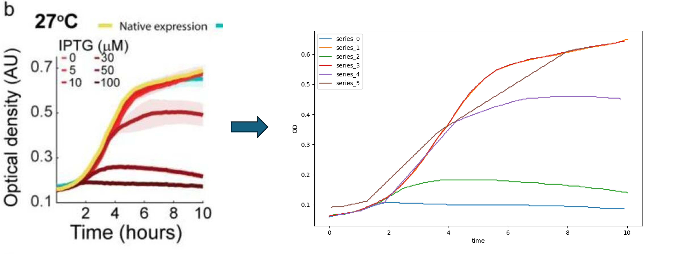
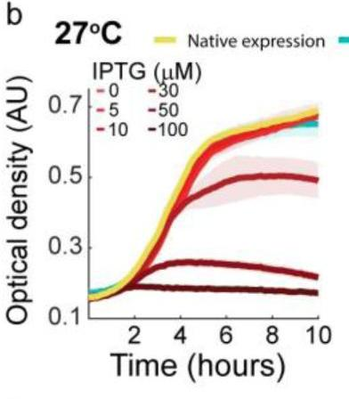
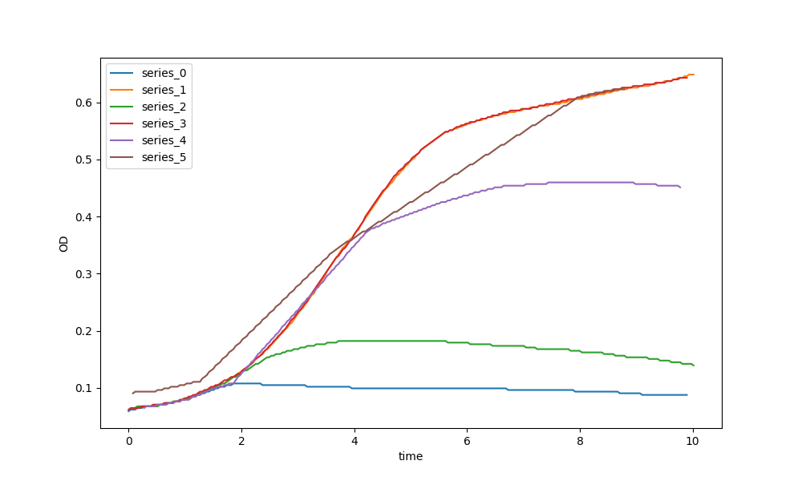

# Extract Line Chart Data

A repo that shows how to automatically extract the data of a line chart. Mainly a wrapper around [LineFormer](https://github.com/TheJaeLal/LineFormer) and [ChartDete](https://github.com/pengyu965/ChartDete/).

## Installation
1. You need a [modal.com](https://modal.com) account to run this repo out of the box. Sign up [here](https://modal.com/signup).
2. Deploy the relevant functions by running: `chmod +x deploy.sh && ./deploy.sh`
If you'd like to see a "modal-free" version of this, ping me.

## Usage
All images in the folder `input` will be processed.
1. Add your images to the `input` folder.
2. Run the data extraction using: `modal run plextract/main.py`
3. Download the processed files using `modal volume get plextract-vol <run_id>`. The run id is a uuid and can be found in the console log.

## How It Works
The pipeline works as follows: 
1. Use ChartDete to detect chart elements, most importantly axis labels and the plot area. 
2. OCR the numbers from the labels. 
3. Extract the coordinates of the lines in the line chart using LineFormer. 
4. Correct the coordinates of the lines to be relative to the plot origin. 
5. Calculate the conversion from pixels to axis values.
6. Convert the coordinates using the conversion parameter from step before.
 

## Example

### Input

### Output
This chart was generated using matplotlib using the extracted data (`example/data.json`)

## Resources
- [LineFormer](https://github.com/TheJaeLal/LineFormer)
- [ChartDete](https://github.com/pengyu965/ChartDete/)

# Contact
If you need help setting this up or would just like to use it, shoot me an email: mail@timonschneider.de