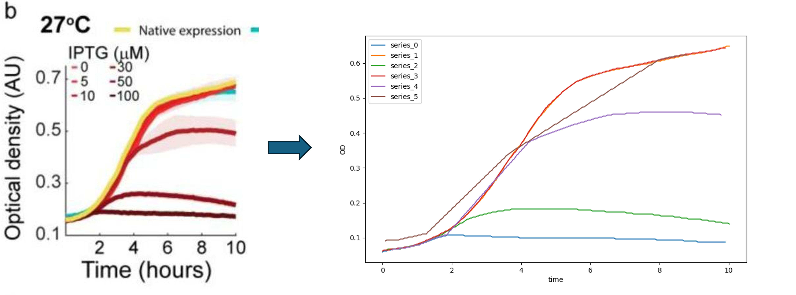
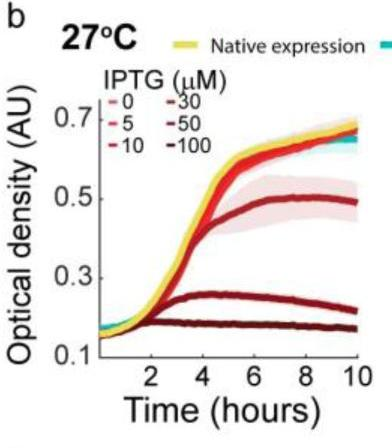
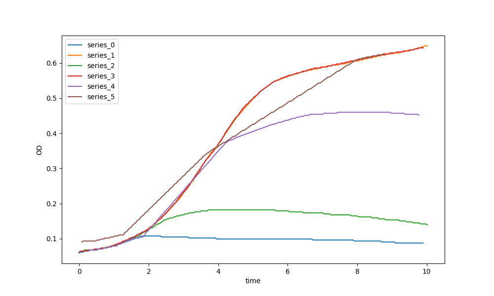

# Extract Line Chart Data


A repo that shows how to automatically extract the data of a line chart. Mainly a wrapper around [LineFormer](https://github.com/TheJaeLal/LineFormer) and [ChartDete](https://github.com/pengyu965/ChartDete/).

## Other Solutions
There's other solutions out there:
- [PP-Chart2Table](https://huggingface.co/PaddlePaddle/PP-Chart2Table) (Huggingface) - haven't tried and would love to hear opinions!
- [Graph2Table](https://graph2table.com/) - commercial SaaS, superior extraction that plextract but only 3 plots per day for free (as of 13.11.25)
- [Deplot](https://huggingface.co/google/deplot) - didn't work well for me on the example plots
- [Matcha ChartQA](https://huggingface.co/google/matcha-chartqa)
- Mostly the mentioned models as [a collection on Huggingface](https://huggingface.co/collections/tdsone/plot-image-2-data)

## Installation

### Base Installation

```bash
pip install plextract
# or with uv
uv pip install plextract
```

This installs only the core utilities. To actually run the pipeline, you need one of the extras below.

### Option 1: Modal (Cloud) - Recommended

Run the pipeline on [Modal's](https://modal.com) cloud infrastructure. No GPU required locally.

```bash
pip install plextract[modal]
# or with uv
uv pip install plextract[modal]
```

You'll also need a [modal.com](https://modal.com) account. Sign up [here](https://modal.com/signup).

### Option 2: Local Execution

Run the pipeline locally with ML models. Requires a GPU with CUDA support.

```bash
pip install plextract[local]
# or with uv
uv pip install plextract[local]
```

**Additional setup for local execution:**
The ChartDete + LineFormer stack requires `mmcv-full` and a custom fork of `mmdet`.

```bash
# from the repo root (after creating/activating your Python 3.10 env)
uv pip install -e ".[local]"
bash setup_local_env.sh
```

`setup_local_env.sh` will:

- install `mmcv-full` via `mim install mmcv-full`
- clone ChartDete into `third_party/ChartDete`
- install the ChartDete `mmdet` fork (`pip install --no-build-isolation -e third_party/ChartDete`)

### Install Everything

```bash
pip install plextract[all]
```

## Usage

All images in the folder `input` will be processed and results saved to `output`.

### Python API

```python
from plextract import extract

# Run locally (requires plextract[local])
extract(input_dir="input", output_dir="output", backend="local")

# Or run on Modal cloud (requires plextract[modal])
extract(input_dir="input", output_dir="output", backend="modal")
```

### CLI / Manual

**With Modal:**
1. Add your images to the `input` folder.
2. In the root folder, run the data extraction using: `modal run -m plextract.app`
3. Download the processed files using `modal volume get plextract-vol <run_id>`. The run id is a uuid and can be found in the console log. For the example files, the result will look like this:

   ```
   <run_id>/
   ├── input
   │   ├── input1.jpeg
   │   ├── input2.jpeg
   │   └── input3.png
   └── output
       ├── input1.jpeg
       │   ├── axis_label_texts.json # Text extracted from axis labels
       │   ├── chartdete
       │   │   ├── bounding_boxes.json
       │   │   ├── cropped_xlabels_0.jpg # Cropped images of axis labels
       │   │   ├── ...
       │   │   ├── cropped_ylabels_0.jpg
       │   │   ├── ...
       │   │   ├── label_coordinates.json # Coordinates of the detected elements
       │   │   └── predictions.jpg # Image with bounding boxes of detected elements
       │   ├── converted_datapoints
       │   │   ├── data.json # The extracted data!
       │   │   └── plot.png # The plot generated from the extracted data
       │   └── lineformer
       │       ├── coordinates.json # The image relative coordinates of the lines
       │       └── prediction.png
       ├── input2.jpeg
       │   ├── ...
       └── input3.png
           ├── ...

   14 directories, 60 files
   ```

4. The extracted data is provided as json: e.g. `<run_id>/output/input1.jpeg/converted_datapoints/data.json`.
5. You can use [display_extracted_data.ipynb](display_extracted_data.ipynb) to plot the extracted data.

## How It Works

The pipeline works as follows:

1. Use ChartDete to detect chart elements, most importantly axis labels and the plot area.
2. OCR the numbers from the labels.
3. Extract the coordinates of the lines in the line chart using LineFormer.
4. Correct the coordinates of the lines to be relative to the plot origin.
5. Calculate the conversion from pixels to axis values.
6. Convert the coordinates using the conversion parameter from step before.

## Example

### Input



### Output

This chart was generated using matplotlib using the extracted data (`example/data.json`)


## Resources

- [LineFormer](https://github.com/TheJaeLal/LineFormer)
- [ChartDete](https://github.com/pengyu965/ChartDete/)

# Contact

If you need help setting this up or would just like to use it, shoot me an email: mail@timonschneider.de